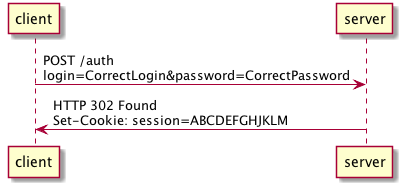
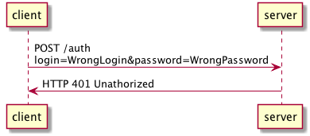
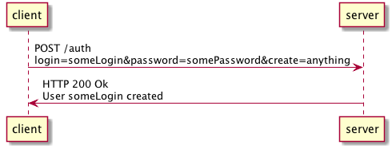
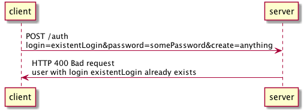

## Passwords
Currently we save SHA256 hash of password, *without* salt

# Diagrams
## Auth
### Positive auth sequence

### Negative auth sequence

## Create user
### Create user - positive sequence

### Create user - negative sequence

