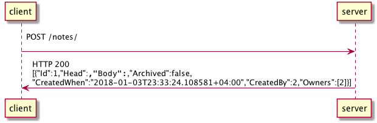

# Diagrams
## Get all user notes - positive sequence

## Create new user note - positive sequence

## Update existent user note - positive sequence

## Delete existent user note - positive sequence

